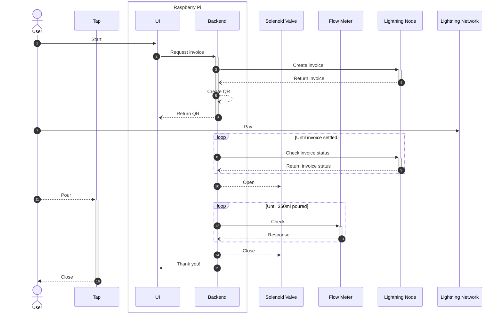

# lightning-beer-server

Lightning Beer Server lets you buy and pour a fixed amount of beer with Lightning payments.

```mermaid
sequenceDiagram
    autonumber
    actor User
    participant tap as Tap
    box Raspberry Pi
      participant ui as UI
      participant bk as Backend
    end
    participant valve as Solenoid Valve
    participant meter as Flow Meter
    participant node as Lightning Node
    participant ln as Lightning Network
    User->>+ui: Start
    ui->>+bk: Request invoice
    bk->>+node: Create invoice
    node--)-bk: Return invoice
    bk--)bk: Create QR
    bk--)-ui: Return QR

    User->>ln: Pay

    loop Until invoice settled
      bk->>+node: Check invoice status
      node--)-bk: Return invoice status
    end

    bk -->> valve: Open
    User -->>+ tap: Pour
    loop Until 350ml poured
      bk->>+meter: Check
      meter--)-bk: Response
    end
    bk -->> valve: Close
    bk -->> ui: Thank you!
    tap -->>- User: Close
```
